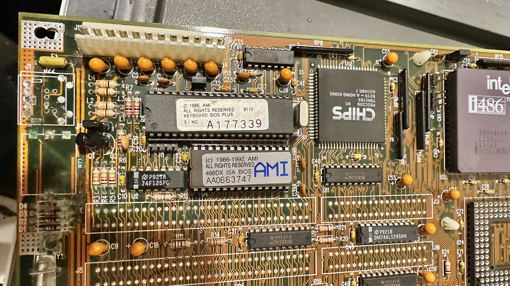
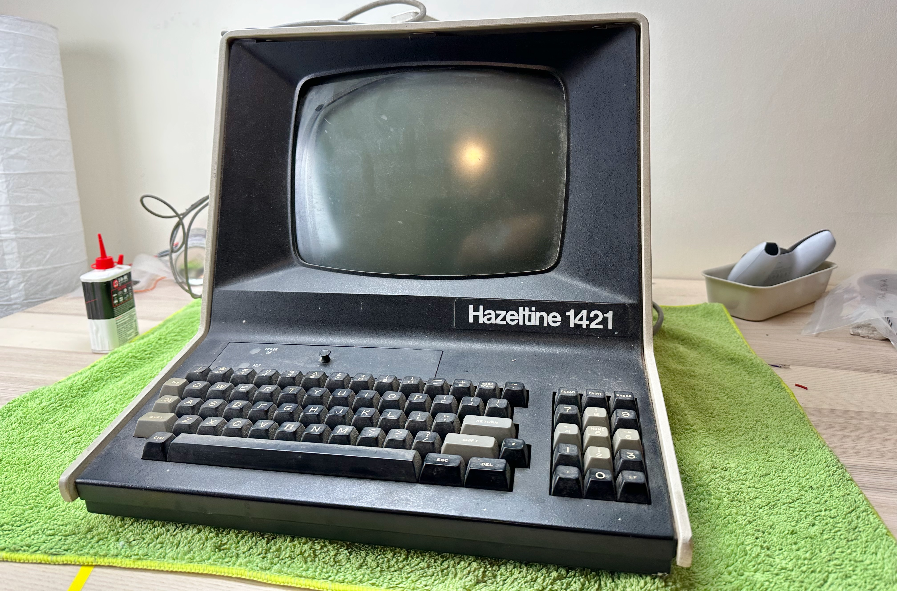
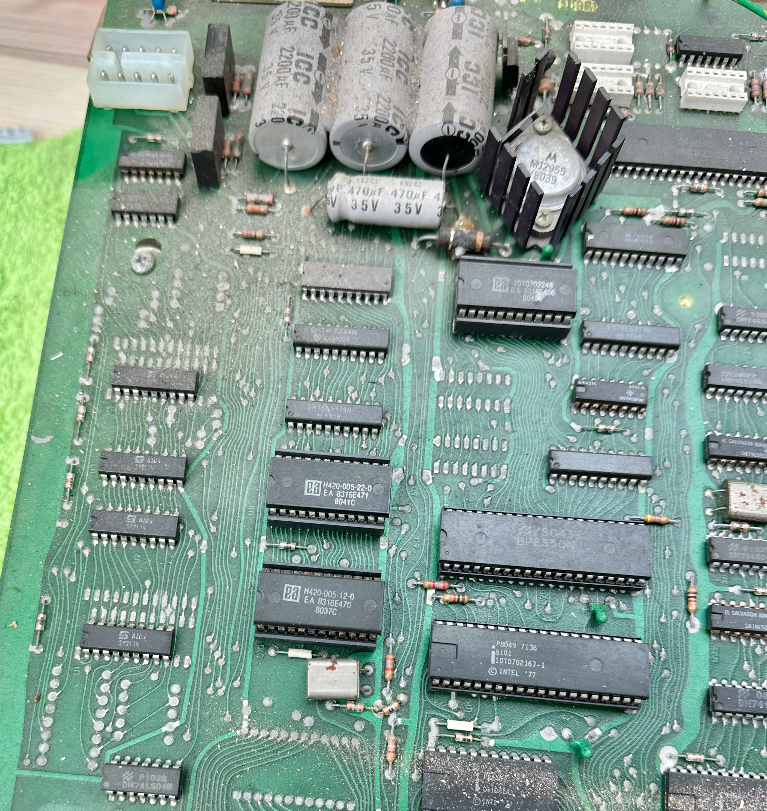

# My ROM Dumps

With my growing retro hardware collection, I thought it would be helpful to preserve the ROM of uncommon ones.

Perhaps someone will stumble upon here when searching for some obscure stuff.

All ROMs here are **physically dumped** using TL866II Plus.

Questions? Info to share? [Raise an issue](https://github.com/dekuNukem/BIOS_ROM_Dumps/issues) or email me dekuNukem gmail com.

## Table of Contents

* [Generic SARC RC2016A4 386SX motherboard](#generic-sarc-rc2016a4-386sx-motherboard)

* [Kaimei SA-486 VL-BUS M.B. REV. V2C 29GDX4-11B](#kaimei-sa-486-vl-bus-mb-rev-v2c-29gdx4-11b)

* [Unknown SiS VLB Motherboard](#unknown-sis-vlb-motherboard)

* [V4P895GRN OPTi VLB](#v4p895grn-opti-vlb)

* [Amstrad PC6486SX](#amstrad-pc6486sx)

* [Hazeltine 1421 Terminal](#hazeltine-1421-terminal)

## Generic SARC RC2016A4 386SX motherboard

#### Date Added (YYYY-MM-DD): 2022-07-06

#### Chipset: RC2016A4

#### (E)EPROM Model: M27C512-15XFI ST SINGAPORE

#### Model String: PTV-93005342

[Click me to download BIOS image](dumps/SARC_386SX.BIN)

This style of cheap and generic 386 motherboards seem to be churned out from Taiwan in large numbers in early 90s.

Usually they have a 386SX running at 20 to 40MHz, not very remarkable.

## Kaimei SA-486 VL-BUS M.B. REV. V2C 29GDX4-11B

#### Date Added (YYYY-MM-DD): 2022-07-06

#### (E)EPROM Model: TMS JL 27C512-15 BLX51A3CVP SINGAPORE

[Click me to download BIOS image](dumps/29GDX4.BIN)

[Detailed information here](https://www.ultimateretro.net/en/dumps/5545)

## Unknown SiS VLB Motherboard

#### Date Added (YYYY-MM-DD): 2022-07-06

#### Chipset: SiS 85C471, SiS 85C407

#### (E)EPROM Model: M27C512-15XFI ST SINGAPORE

[Click me to download BIOS image](dumps/SIS_85C471.BIN)

I don't see any model number or identification strings on this motherboard. Very mysterious!

Info to share? [Raise an issue](https://github.com/dekuNukem/BIOS_ROM_Dumps/issues) or email me dekuNukem gmail com.

## V4P895GRN OPTi VLB

#### Date Added (YYYY-MM-DD): 2022-07-06

#### Chipset: OPTi 82C895, OPTi 82C602

#### (E)EPROM Model: L27C512X

#### Model String: PTV-93005342

[Click me to download BIOS image](dumps/V4P895GRN.BIN)

## Amstrad PC6486SX

#### Date Added (YYYY-MM-DD): 2022-11-22

#### (E)EPROM Model: 27C512

#### Model String: CAM33-P2

[Click me to download BIOS image](dumps/amstrad_PC6486sx_27C512@DIP28.BIN)

Just another generic IBM compatible with off-the-shelf motherboard, kinda regret buying it tbh.

Comes with 25MHz 486SX, 4MB RAM, Trident ISA video card, IO card.

[More info here](https://stason.org/TULARC/pc/dumps/A/AUVA-COMPUTER-INC-486-CAM33-P2-CPM20-P0-CPM25-P0.html)

## Hazeltine 1421 Terminal

#### Date Added (YYYY-MM-DD): 2022-11-22

#### (E)EPROM Model: Mask ROM 2716 Equivalent

Very little information about this one, seems very similar to Hazeltine 1420, still working on fixing it, excuse the dust!

Three mask ROMs, all 2716 equivalent. Lower two for the CPU, upper right character ROM.

[hazeltine_1421_H420_005_22_0](dumps/hazeltine_1421_H420_005_22_0_M2716@DIP24.BIN)

[hazeltine_1421_H420_005_12_0](dumps/hazeltine_1421_H420_005_12_0_M2716@DIP24.BIN)

[hazeltine_1421_1DTD702248_CHAR_ROM](dumps/hazeltine_1421_1DTD702248_CHAR_ROM_M2716@DIP24.BIN)

Questions? Info to share? [Raise an issue](https://github.com/dekuNukem/BIOS_ROM_Dumps/issues) or email me dekuNukem gmail com.
